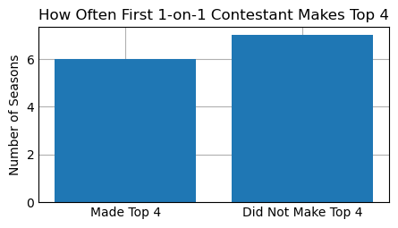
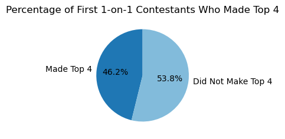
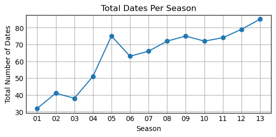

# Does the First One-on_One Date Really Matter?

When the new season of the Bachelorette begins, every girl becomes captivated by the competition of love and drama whether they intend it or not.  They will spend the next twelve to fourteen Monday nights hanging out on the couch, alone or with friends, and a big bowl of popcorn on their laps to watch the new bachelorette's journey unfold. Every real fan knows that it is normal to predict who is going to reach a certain point in the season.  For me and my friends, we predict the top 4 contestants who are making it to hometowns.  I always believed the first one-on-one date predicts long-term success despite popular opinion that the first impression rose is most important.  In order to impress my friends this upcoming march, I wanted to test whether the first one-on-one date really does play an important role. Using contestant data across multiple seasons, I analyzed whether receiving the first one-on-one date increases a contestant’s chances of making it to the Top 4. The following visualizations also highlight what I found. 

## How Often Does the First One-on-One Make the Top 4?

After analyzing my data, I created a barchart that compares the number of seasons where at least one first one-on-one contestant made the Top 4 versus seasons where they did not. While the bars are relatively close in height, the “Did Not Make Top 4” bar is noticeably taller. This immediately suggests that receiving the first one-on-one date does not guarantee long-term success on the show. 

What stands out most to me is that early favoritism and attention does not correlate in the long run and gaurantee a future spot. Despite the viewers opinions that first one-on-one dates mean a lot and show who the bachelorette is interested in, nearly half the time those contestants fail to reach the final four. This challenges the assumption that early favoritism ensures a spot in the final four.

## Percentage of First 1-on-1 Contestants Who Made the Top 4

To get a better understanding of these findings, I also created a pie chart that represents the percentages of the contestants who did make the final 4 and those who did not make the final four. 

Approximately 46% of first one-on-one contestants made the Top 4, while about 54% did not make the top 4. This near-even split reinforces the idea that the first one-on-one date is not a reliable predictor of long-term success.  What makes this result interesting is how closely divided the outcomes are. If first one-on-one dates truly signaled a strong advantage, we would expect the “Made Top 4” slice to take up most of the chart. Instead, the majority outcome is actually elimination before the Top 4, highlighting the unpredictability of the show. 

## Total Dates Per Season

I also created a line chart that shows the total number of dates for seasons 1-13. Over time, the number of dates increases for the most part, especially in later seasons. This reflects how the structure of the show has changed, with more group dates, one-on-ones, and overall screen time given to contestants.  I think this might have to do with the idea that the viewers have become more skeptical of contestants “falling in love” that quickly.  The show appears to provide more opportunities for interactions, allowing relationships to develop more gradually and even convince the viewers that this is real love. 

As seasons include more dates and more opportunities for connections to form, the importance of a one-on-one early date may decrease. In later seasons especially, contestants have more chances to build relationships even if they do not receive the first one-on-one.  I think this gives the contestants more hope and calms the idea that nothing is set in stone even after the first couple one-on-one dates.  

## Conclusion

Overall, the data suggests that while receiving the first one-on-one date can be a promising start, it does not guarantee a Top 4 finish on The Bachelorette. In fact, slightly more than half of the seasons analyzed showed that the first contestant with a one-on-one is usually eliminated before reaching the final four. As the show has evolved and expanded the number of dates per season, success appears to depend more on connections slowly building throughout the season rather than early favoritism and first impressions. This analysis highlights how reality TV narratives can be misleading when not backed by data. While first impressions matter, they do not decide whether a contestant will make it to hometowns.  